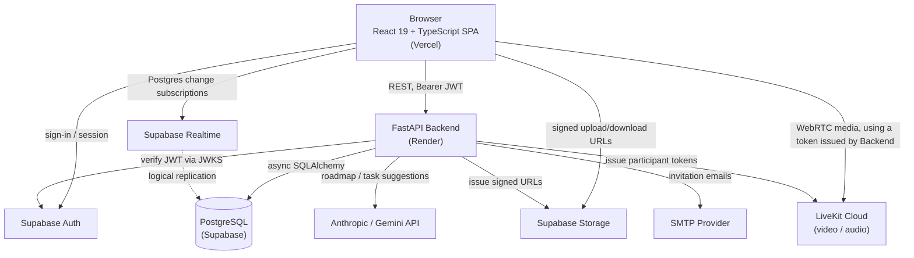

# Study Together System

A full-stack platform for collaborative learning: study groups with text channels, live video study rooms with a shared whiteboard and presentation view, a discussion forum, personal learning-goal roadmaps with AI assistance, and realtime chat and notifications. It is built for learners who want to organize study groups, share resources, and meet online, and includes a full moderation and trust-and-safety layer for community management.

**Live Demo:** [gfeg-delta.vercel.app](https://gfeg-delta.vercel.app/)

- [Study Together System](#study-together-system)
  - [Overview](#overview)
  - [Key Features](#key-features)
  - [Technology Stack](#technology-stack)
  - [System Architecture](#system-architecture)
  - [Project Structure](#project-structure)
  - [Getting Started](#getting-started)
    - [Prerequisites](#prerequisites)
    - [Clone the repository](#clone-the-repository)
    - [Backend setup](#backend-setup)
    - [Frontend setup](#frontend-setup)
    - [Running both together](#running-both-together)
  - [Environment Variables](#environment-variables)
    - [Backend (`.env`, see .env.example)](#backend-env-see-envexample)
    - [Frontend (`frontend/.env`, see frontend/.env.example)](#frontend-frontendenv-see-frontendenvexample)
  - [Database](#database)
  - [API Documentation](#api-documentation)
  - [Main Application Flows](#main-application-flows)
  - [Roles and Permissions](#roles-and-permissions)
  - [Testing](#testing)
    - [Backend](#backend)
    - [Frontend](#frontend)
  - [Deployment](#deployment)
  - [Contributors](#contributors)
  - [Future Improvements](#future-improvements)
  - [Documentation](#documentation)


## Overview

The system consists of a FastAPI backend (`app/`) exposing a REST API over a PostgreSQL database hosted on Supabase, and a React + TypeScript frontend (`frontend/`) that consumes that API directly and also talks to Supabase (Auth, Storage, Realtime) and LiveKit Cloud from the browser.

Chat across group channels, study rooms, and direct messages is unified behind a single `Conversation` abstraction on the backend, with message history served over REST and live updates delivered through Supabase Realtime. Study Rooms add real-time video/audio via LiveKit, a collaborative whiteboard, and synced slide presentations. A discussion forum supports rich-text posts, nested comments, and emoji reactions, backed by a dedicated moderation subsystem (roles, bans, reports, audit log). Personal learning goals ("roadmaps") can be scaffolded automatically using an AI provider (Anthropic Claude or Google Gemini).

## Key Features

- **Authentication & Profiles** — Supabase-backed sign-up, sign-in, and password reset; user profiles with avatars and site-wide roles (user / moderator / admin).
- **Learning Goals (Roadmaps & Tasks)** — create personal roadmaps with phases; optionally generate a roadmap, clarifying questions, and a detailed task list with an AI provider; track tasks with due-date reminders.
- **Study Groups** — create and manage groups with owner/moderator/member roles, membership status, background customization, and per-group activity streaks.
- **Group Channels** — public and private text channels scoped to a group.
- **Study Rooms** — live study sessions with LiveKit-powered video/audio, host/moderator/participant roles, moderation actions (mute, kick, raise/lower hand), a collaborative whiteboard (tldraw), and a synced slide presentation viewer.
- **Realtime Messaging** — a unified conversation model (channel / room / direct message) with message reactions, image attachments, unread tracking, and Supabase Realtime updates.
- **Direct Messages** — one-to-one conversations independent of any group.
- **Resource Sharing** — nested folders and files per group, stored in Supabase Storage via signed upload/download URLs.
- **Group Notes** — shared, realtime-synced notes scoped to a group.
- **Discussion Forum** — categories, rich-text posts (tables, images, math formulas), nested comments, emoji reactions, and hashtags with fuzzy search.
- **Notifications** — an in-app notification feed with unread counts, task reminders, and invitation alerts, updated in realtime.
- **Invitations** — secure, TTL-bound email or code invitations to a group, study room, or private channel.
- **Moderation & Trust/Safety** — site-wide moderator/admin roles, typed user bans (posting, messaging, group creation/joining, room joining) with configurable durations, user reports, and an audit log of moderation actions.

## Technology Stack

| Layer | Technologies |
|---|---|
| Frontend | React 19, TypeScript, Vite, React Router 7 |
| Backend | Python 3.13, FastAPI, SQLAlchemy 2.0+ (async), Pydantic Settings |
| Database | PostgreSQL, hosted on Supabase; plain SQL migrations |
| Authentication | Supabase Auth (JWT verified server-side against Supabase's JWKS) |
| Realtime | Supabase Realtime (Postgres change streams) for chat, notes, notifications, presence |
| Video / Study Rooms | LiveKit Cloud — `livekit-api` (backend token issuance), `livekit-client` and `@livekit/components-react` (frontend) |
| Whiteboard | tldraw, synced over LiveKit data channels |
| Rich Text / Documents | Tiptap editor with KaTeX math rendering; pdf.js for presentation slides |
| Storage | Supabase Storage (private buckets, signed URLs issued by the backend) |
| AI Assistance | Anthropic Claude or Google Gemini (selectable via `AI_PROVIDER`) for roadmap/task suggestions |
| Email | SMTP (any standard provider) for invitation emails, with a console fallback in development |
| Testing | pytest / pytest-asyncio (backend), Vitest + React Testing Library (frontend) |
| Deployment | Render (backend), Vercel (frontend) |

## System Architecture



The frontend never talks to Postgres, Storage, or LiveKit media directly without a credential the backend issued: Supabase session tokens come from Supabase Auth, Storage URLs and LiveKit tokens are minted by FastAPI after an authorization check, and Realtime subscriptions are scoped by Supabase's Row Level Security policies.

## Project Structure

```text
.
├── app/                     # FastAPI backend
│   ├── auth/                # Supabase token verification, get_current_user dependency
│   ├── profiles/            # user profiles, avatars, site-wide roles
│   ├── groups/               # study groups, membership, streaks
│   ├── channels/             # text channels + membership
│   ├── conversations/        # unified channel/room/direct conversation abstraction
│   ├── messages/              # message CRUD, pagination, reactions
│   ├── attachments/           # signed upload/download URLs for chat attachments
│   ├── study_rooms/           # study rooms, membership, whiteboard, presentation state
│   ├── meetings/               # LiveKit participant-token issuance and room admin ops
│   ├── resources/              # group resource folders/files (Supabase Storage)
│   ├── notes/                   # shared group notes
│   ├── roadmaps/                # learning-goal roadmaps + AI suggestion service
│   ├── tasks/                    # study tasks and reminders
│   ├── forum/                     # categories, posts, comments, tags, reactions
│   ├── moderation/                 # roles, bans, reports, moderation audit log
│   ├── invitations/                 # email/code invitations to groups/rooms/channels
│   ├── notifications/                # notification feed and reminder scheduler
│   ├── core/                          # settings, permission helpers, email service
│   └── db/                             # SQLAlchemy engine/session, shared enums
├── tests/                    # pytest suite (unit/API tests + tests/integration)
├── docs/
│   ├── db/
│   │   ├── STUDY_PLATFORM_DATABASE_SPEC.md   # full schema and business rules
│   │   └── migrations/                       # numbered SQL migrations + status README
│   └── invitations.md        # invitation system design notes
├── scripts/                  # dev helpers: open_swagger, realtime check, seed data
├── dev.py                    # runs backend (uvicorn) + frontend (vite) together
├── run.py                    # backend entry point
├── render.yaml                # Render deployment config (backend)
└── frontend/                  # React + TypeScript + Vite app
    ├── src/
    │   ├── main.tsx            # app entry point, providers
    │   ├── routes/              # route table, ProtectedRoute / ModeratorRoute guards
    │   ├── contexts/             # Auth, unread messages, notifications
    │   ├── lib/                   # Supabase client, API client, per-domain API modules
    │   ├── hooks/                  # data-fetching and realtime-sync hooks
    │   ├── components/              # layout, UI kit, chat, invitations, moderation
    │   ├── pages/                    # Home/Forum, Study Groups, Study Room, Aim, Settings...
    │   └── test/                      # Vitest setup
    └── vercel.json              # Vercel SPA rewrite config
```

Each `app/<domain>/` package follows the same internal layout: `entities/` (SQLAlchemy models), `dto/` (Pydantic schemas), `services/` (business logic), `routers/` (FastAPI routes).

## Getting Started

### Prerequisites

- Python 3.13
- Node.js 20+ and npm
- A Supabase project (PostgreSQL database, Auth, and Storage)
- A LiveKit Cloud project (required for Study Room video/audio)
- Optional: an Anthropic or Google Gemini API key (for AI roadmap suggestions), and SMTP credentials (for real invitation emails — otherwise emails are logged to the console)

### Clone the repository

```bash
git clone https://github.com/awesome-academy/python-naitei26_study-together-system.git
cd python-naitei26_study-together-system
```

### Backend setup

```bash
python -m venv .venv
source .venv/bin/activate        # Windows: .venv\Scripts\Activate.ps1
pip install -r requirements.txt
cp .env.example .env             # fill in real values, see Environment Variables below
```

Apply database migrations manually against your Supabase project (see [Database](#database)), then start the server:

```bash
uvicorn app.main:app --reload
# or: python run.py
```

The API is served at `http://localhost:8000`.

### Frontend setup

```bash
cd frontend
npm install
cp .env.example .env             # fill in real values, see Environment Variables below
npm run dev
```

The Vite dev server is served at `http://localhost:5173`.

### Running both together

From the repository root:

```bash
python dev.py
```

This starts the backend and frontend concurrently, prefixing each process's log output.

## Environment Variables

### Backend (`.env`, see [.env.example](.env.example))

```env
# Database
DATABASE_URL=

# Supabase
SUPABASE_URL=
SUPABASE_PUBLISHABLE_KEY=
SUPABASE_SECRET_KEY=              # preferred elevated key for Storage admin operations
SUPABASE_SERVICE_ROLE_KEY=        # legacy fallback if SUPABASE_SECRET_KEY is unset
ATTACHMENT_DOWNLOAD_URL_EXPIRES_IN=300

# LiveKit
LIVEKIT_URL=
LIVEKIT_API_KEY=
LIVEKIT_API_SECRET=

# CORS
CORS_ALLOWED_ORIGINS=http://localhost:5173

# Invitations
INVITATION_CODE_TTL_SECONDS=300
INVITATION_EMAIL_TTL_SECONDS=604800
FRONTEND_BASE_URL=http://localhost:5173

# Email (optional — logged to console if SMTP_HOST is unset)
SMTP_HOST=
SMTP_PORT=587
SMTP_USERNAME=
SMTP_PASSWORD=
SMTP_USE_TLS=true
EMAIL_FROM_ADDRESS=

# AI roadmap suggestions (optional — disabled if the selected provider's key is unset)
AI_PROVIDER=anthropic             # "anthropic" or "gemini"
ANTHROPIC_API_KEY=
GEMINI_API_KEY=
```

`SUPABASE_SECRET_KEY` (or `SUPABASE_SERVICE_ROLE_KEY`) is required for attachment and resource upload/download URL endpoints, since these call Supabase Storage's admin API.

### Frontend (`frontend/.env`, see [frontend/.env.example](frontend/.env.example))

```env
VITE_API_BASE_URL=          # e.g. http://localhost:8000
VITE_SUPABASE_URL=
VITE_SUPABASE_ANON_KEY=
```

LiveKit connection details are not configured on the frontend directly — the backend issues a short-lived, room-scoped participant token per join request.

## Database

The database is PostgreSQL hosted on Supabase. Migrations are plain, hand-written SQL files under [docs/db/migrations/](docs/db/migrations/), applied manually against the project (via the Supabase SQL editor or `psql`) — nothing is auto-applied by the application or by CI.

Larger or riskier migrations follow a `preflight → migration → verify` convention, with an optional `_rollback.sql` kept as a reviewed undo path. Each migration's live/pending status is tracked in [docs/db/migrations/README.md](docs/db/migrations/README.md). Major milestones include the introduction of a unified `Conversation` model, group resources and profile-avatar Storage buckets, message and forum reactions, a site-wide moderation system (roles, bans, reports), group activity streaks, synced study-room presentation state, and fuzzy hashtag search.

The full schema, relationships, and business rules are documented in [docs/db/STUDY_PLATFORM_DATABASE_SPEC.md](docs/db/STUDY_PLATFORM_DATABASE_SPEC.md). Sample/demo data can be loaded with the scripts under [scripts/](scripts/) (`seed_forum.py`, `seed_rich_data.py`, `seed_qa_users.py`), run directly against a configured `.env`.

## API Documentation

FastAPI's interactive documentation is available at:

```text
/docs        # Swagger UI
/redoc       # ReDoc
/openapi.json
```

```bash
python -m scripts.open_swagger   # starts the server and opens Swagger UI
```

Endpoints are grouped by domain:

| Area | Prefix |
|---|---|
| Auth | `/auth` |
| Profiles | `/profiles` |
| Groups | `/groups` |
| Channels | `/channels` |
| Conversations | `/conversations` |
| Messages | `/messages` |
| Attachments | `/conversations/{id}/attachments`, `/messages/{id}/attachment-url` |
| Study Rooms | `/study-rooms` |
| Resources | `/resources` |
| Notes | `/notes` |
| Roadmaps (Goals + AI suggestions) | `/roadmaps` |
| Tasks | `/tasks` |
| Forum | `/forum` |
| Moderation | `/moderation` |
| Invitations | `/invitations` |
| Notifications | `/notifications` |

See `/docs` for the complete, always-current list of endpoints and schemas.

## Main Application Flows

- **Authentication** — the frontend signs in through Supabase Auth; the resulting access token is attached as a `Bearer` header on every backend request and verified server-side against Supabase's JWKS.
- **Learning goals** — a user describes a goal, optionally answers a few AI-generated clarifying questions, and receives an AI-generated roadmap with phases and a detailed task list, which they can then edit and track manually.
- **Study groups** — a user creates a group, invites others by email or a short-lived code, and manages channels, resources, and members within it.
- **Study rooms** — a group member starts a room; participants join a LiveKit video/audio session, collaborate on a shared whiteboard or presentation, and chat in a room-scoped conversation; hosts/moderators can mute, kick, or manage raised hands.
- **Realtime messaging** — channel, room, and direct-message conversations share one messaging model; new messages, reactions, and unread counts propagate live via Supabase Realtime.
- **Forum & moderation** — users post and comment with a rich-text editor and react with emoji; moderators review reports, issue typed bans, and see an audit trail of moderation actions.

## Roles and Permissions

| Scope | Role | Responsibilities |
|---|---|---|
| Site-wide | User | Default role: participate in groups, forum, and rooms they belong to. |
| Site-wide | Moderator | Review forum reports, moderate posts/comments, issue user bans. |
| Site-wide | Admin | Full moderation authority, including managing other moderators. |
| Group | Member | Participate in the group's channels, resources, and rooms. |
| Group | Moderator | Manage channels, members, and study rooms within the group. |
| Group | Owner | Full control of the group, including deleting it and managing bans. |
| Study Room | Participant | Join, chat, and view the shared whiteboard/presentation. |
| Study Room | Host / Moderator | Start/end the room, moderate participants (mute, kick, raise/lower hand), edit the whiteboard/presentation. Authority derives from the caller's current Group role, not room ownership. |

## Testing

### Backend

```bash
pytest tests/ -q
```

- `tests/test_*.py` — unit/API tests running against an in-process ASGI app, no live network or database (26 test modules).
- `tests/integration/` — end-to-end tests against a real Supabase project; they sign in three pre-existing Supabase Auth users via `SUPABASE_TEST_USER_A_EMAIL`/`PASSWORD`, `SUPABASE_TEST_USER_B_EMAIL`/`PASSWORD`, and `SUPABASE_TEST_OUTSIDER_EMAIL`/`PASSWORD`; any test missing these is skipped automatically.
- [scripts/realtime_integration_check.py](scripts/realtime_integration_check.py) is a standalone, manually-run script that opens real Supabase Realtime WebSocket connections to verify chat authorization; it is not part of the pytest suite.

### Frontend

```bash
cd frontend
npm test        # vitest run
npm run lint     # oxlint
npm run build    # tsc -b && vite build
```

The frontend has a Vitest + React Testing Library suite (29 test files) covering auth context, realtime hooks, meeting/whiteboard components, chat, group settings, and invitations.

## Deployment

The backend is deployed to **Render** as a Python web service (see [render.yaml](render.yaml)): `pip install -r requirements.txt` to build, `uvicorn app.main:app --host 0.0.0.0 --port $PORT` to start, with all secrets configured as Render environment variables. A `GET /health` endpoint keeps the app reachable and lets the frontend detect and gracefully handle Render's free-tier cold starts.

The frontend is deployed to **Vercel** as a static Vite build, with a single SPA rewrite rule in [frontend/vercel.json](frontend/vercel.json) so client-side routes resolve correctly. The live deployment is available at [gfeg-delta.vercel.app](https://gfeg-delta.vercel.app/).

There is currently no automated CI/CD pipeline in the repository; deployments are triggered by each platform's Git integration.

## Contributors

| Contributor         | Primary Contributions                                                                                                                                                                                    |
| ------------------- | -------------------------------------------------------------------------------------------------------------------------------------------------------------------------------------------------------- |
| **Nguyễn Tuấn Anh** | Contributed to the project's initial concept and direction; developed Q&A functionality, learning-goal features, and key parts of the discussion forum.                                                  |
| **Thái Mỹ Anh**     | Contributed to frontend UI/UX design and implementation; developed discussion forum features and the notification system.                                                                                |
| **Nguyễn Đức Hiếu** | Contributed to frontend UI/UX design and implementation; developed learning-goal and roadmap-related functionality.                                                                                      |
| **Trịnh Văn Minh**  | Designed and implemented the study group, group channel, and study room modules, including LiveKit integration; built the realtime messaging and moderation systems; and managed application deployment. |


## Future Improvements

- Finish and re-verify the remaining pending database migrations (personal-workspace Realtime sync, roadmap/task tables) tracked in [docs/db/migrations/README.md](docs/db/migrations/README.md).
- Enforce study room and channel member capacity limits, which currently exist as schema fields but are not checked anywhere.
- Allow a member who has left a public group to rejoin directly, instead of only via a new invitation.
- Add automated CI (linting, type-checking, and test execution on push/PR) — currently all checks are run locally.
- The collaborative whiteboard is currently restricted to local/development environments due to the whiteboard library's licensing terms and is disabled in production.

## Documentation

- [docs/db/STUDY_PLATFORM_DATABASE_SPEC.md](docs/db/STUDY_PLATFORM_DATABASE_SPEC.md) — full schema, relationships, and business rules.
- [docs/db/migrations/README.md](docs/db/migrations/README.md) — migration run order and live status.
- [docs/invitations.md](docs/invitations.md) — invitation system design and lifecycle.
